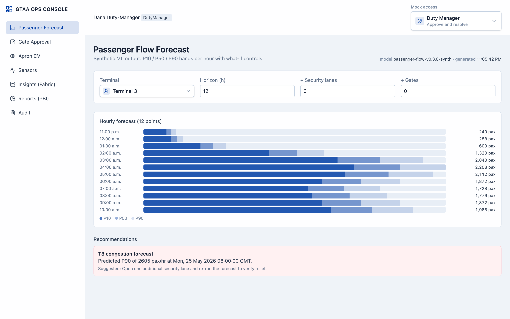
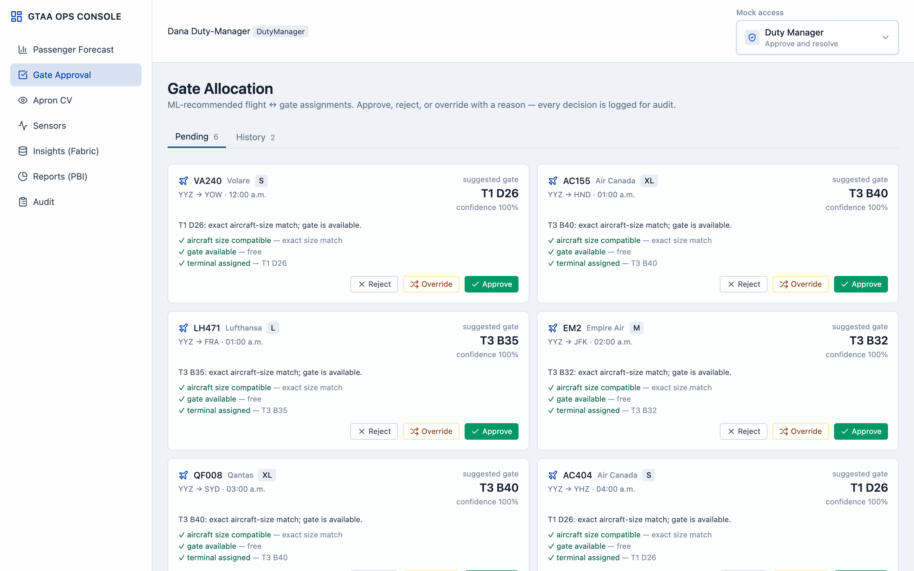
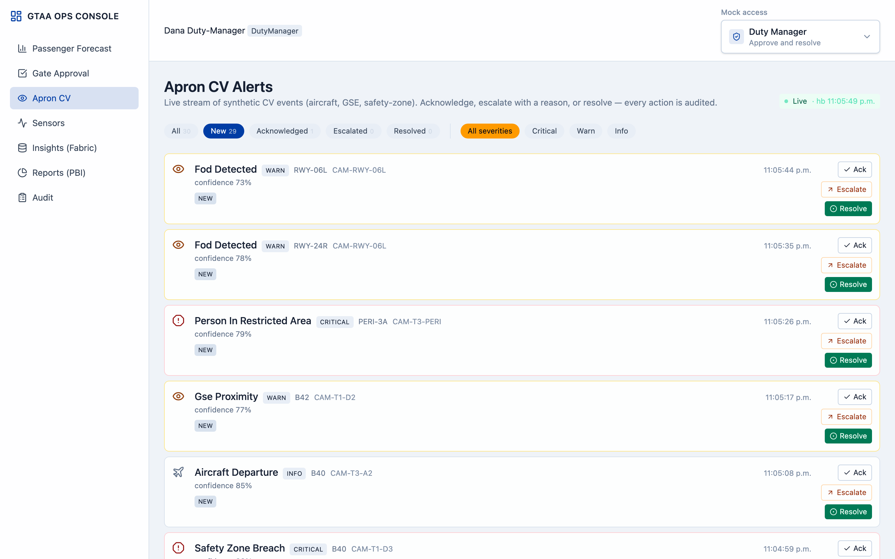
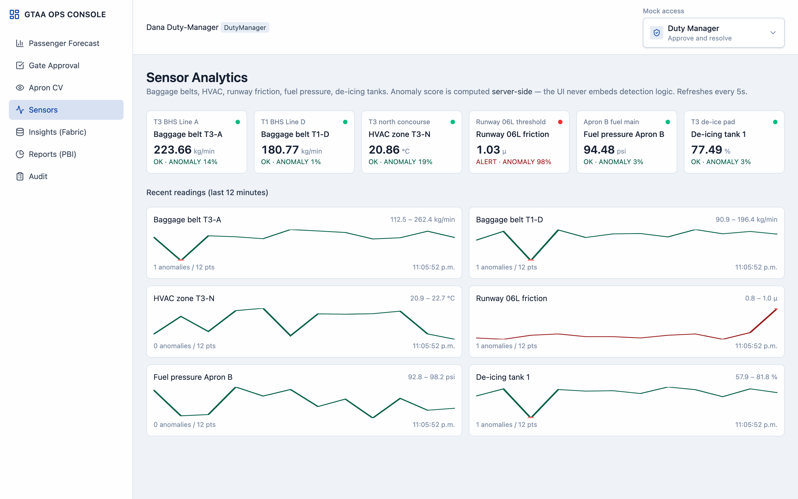
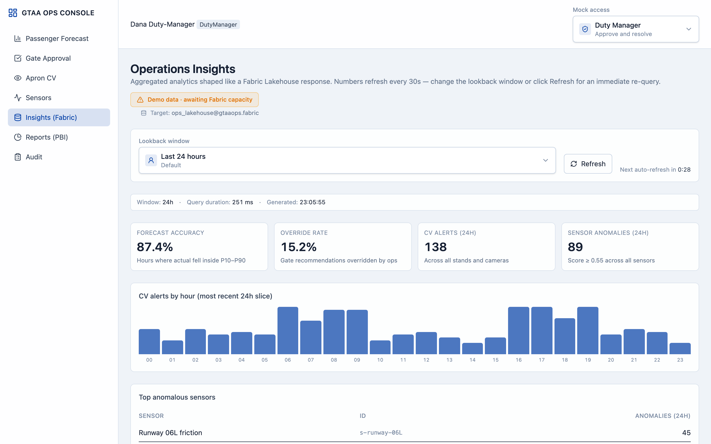
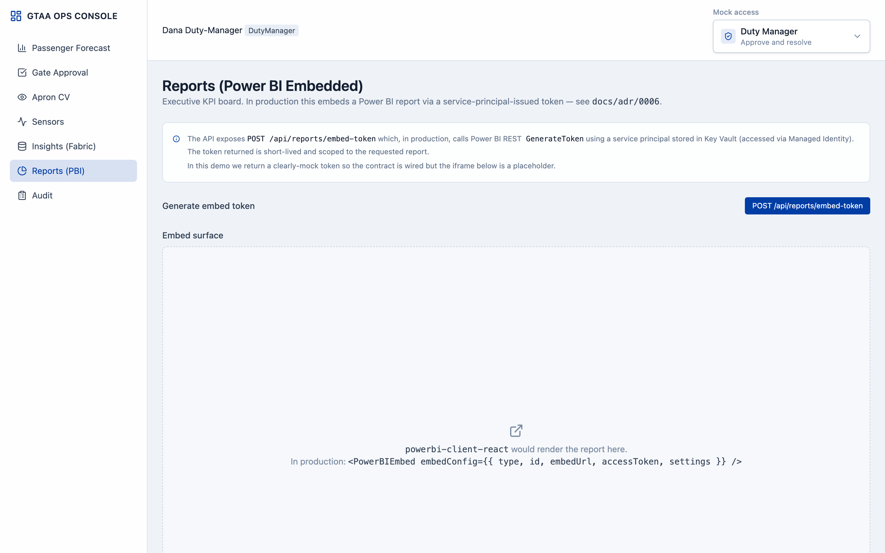
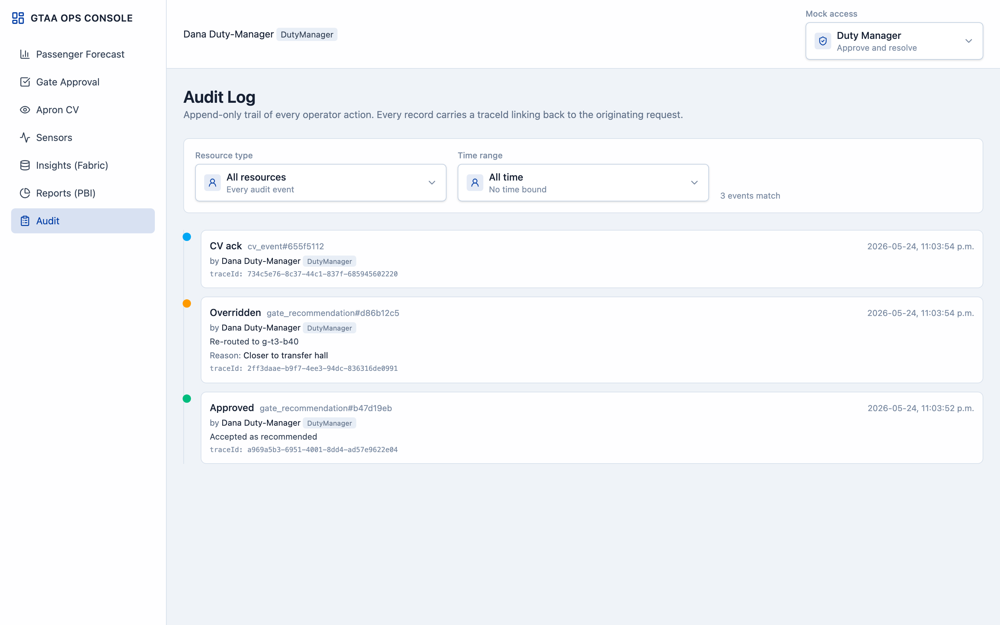
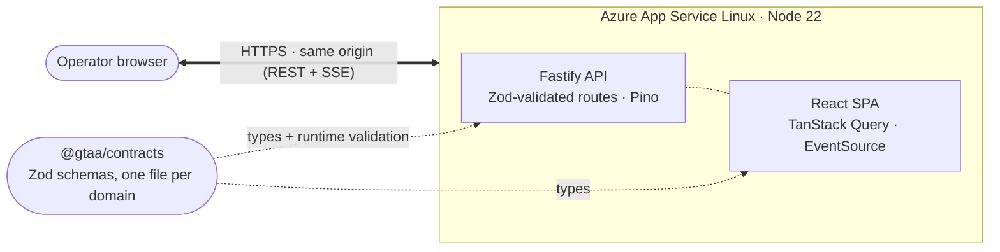

# GTAA Ops Console

Decision-support console for airport operations — a unified surface for ML
forecasts, computer-vision alerts, sensor analytics, and gate-allocation
workflows with full audit traceability.

| Link | URL |
| --- | --- |
| Live demo | https://gtaa-ops-a04931.azurewebsites.net |
| API docs | https://gtaa-ops-a04931.azurewebsites.net/docs |
| Health check | https://gtaa-ops-a04931.azurewebsites.net/health |

## Screens

Captured from the live deployment (Duty Manager role). The hosted demo runs on
Azure App Service Linux F1, which sleeps after ~20 minutes of inactivity — the
first request after a quiet period may take a few seconds to warm up. These
images let you skim the UI without that wait.

### Passenger Forecast — hourly P10 / P50 / P90 with what-if controls



### Gate Allocation Approval — approve / reject / override with audited reason



### Apron CV — live SSE stream of synthetic computer-vision alerts



### Sensors — anomaly scoring computed server-side, never in the UI



### Operations Insights — Microsoft Fabric Lakehouse pattern (demo mode labeled)



### Reports — Power BI embed-token endpoint pattern



### Audit Log — immutable trail with filters and traceId



## Demo access

Use the **Mock access** dropdown in the top-right of the app.

| Role | What it can do |
| --- | --- |
| Viewer | Read-only access |
| Duty Manager | Approve/reject/override gate recommendations and act on CV alerts |
| Ops Manager | Higher-role operator view for the same protected workflows |

Mock auth is used only for local/demo mode and stands in for Entra ID app roles.
See `apps/api/src/plugins/auth.ts` and
[ADR 0004](docs/adr/0004-entra-id-app-roles-not-groups.md).

## What's inside

| Module                   | Purpose                                                                                   | Tier   |
| ------------------------ | ----------------------------------------------------------------------------------------- | ------ |
| Passenger Flow Forecast  | Hourly P10/P50/P90 forecast per terminal, what-if controls, recommendation cards          | Deep   |
| Gate Allocation Approval | ML recommendations for flight↔gate matching with approve/reject/override + audit trail    | Deep   |
| Apron CV Alerts          | Stream of synthetic CV events (aircraft, GSE, safety zone) with ack/escalate/resolve flow | Deep   |
| Reports (Power BI)       | Embedded executive KPI board (embed token endpoint pattern)                               | Medium |
| Sensor Anomaly Strip     | Baggage / HVAC / runway sensors with anomaly scoring computed server-side                 | Medium |
| Audit Log                | Append-only trail of every operator action, filterable by actor / resource / time         | Cross  |

## Architecture



A single Azure App Service hosts both surfaces. The React SPA is built ahead
of time and served as static files by Fastify (`@fastify/static`), with an
SPA fallback for client-side routes. The API, Swagger UI (`/docs`), and the
SPA all share one origin — no CORS configuration in production.

### Tech stack

- **Frontend**: React 18, Vite 6, Tailwind v4, React Router, TanStack Query
- **Backend**: Node 22, Fastify 5, Zod, fastify-type-provider-zod, Pino
- **Contracts**: shared Zod schemas in `packages/contracts` (one file per domain)
- **Auth**: MSAL-style. Mock mode in dev / demo (header `X-Mock-User: viewer|duty|ops`), Entra ID app roles for production
- **Infra**: Azure App Service Linux (single host for API + SPA), built locally with esbuild + Vite and deployed via `az webapp deploy --type zip`
- **Planned**: GitHub Actions OIDC for automated deploys, Bicep IaC, Application Insights wiring, Key Vault for Power BI / Fabric credentials

See [`docs/ARCHITECTURE.md`](docs/ARCHITECTURE.md) for the full picture and
[`docs/adr/`](docs/adr/) for design decisions.

## Quickstart

```bash
pnpm install

# In two terminals:
pnpm --filter @gtaa/api dev             # API on http://localhost:8787
pnpm --filter @gtaa/web dev             # Web on http://localhost:5173
```

Open <http://localhost:5173/forecast> — pick a mock user from the top-right
dropdown.

### Verify the API directly

```bash
curl http://localhost:8787/health
curl -H "X-Mock-User: duty" http://localhost:8787/api/auth/me
curl -H "X-Mock-User: duty" \
  "http://localhost:8787/api/forecasts/passenger-flow?terminal=T3&horizonHours=12"
```

Swagger UI: <http://localhost:8787/docs>

## Layout

```
gtaa-ops-console/
├── apps/
│   ├── api/                # Fastify + TypeScript
│   └── web/                # React + Vite
├── packages/
│   └── contracts/          # Shared API schemas (Zod) — one file per domain
├── docs/
│   ├── ARCHITECTURE.md
│   ├── RUNBOOK.md
│   └── adr/                # Architecture Decision Records
└── infra/                  # (planned) Bicep + GitHub Actions
```

## Testing

```bash
pnpm --filter @gtaa/api test     # Fastify-inject tests covering auth, gates, CV, sensors, reports, insights, audit
pnpm typecheck                   # all workspaces
```
