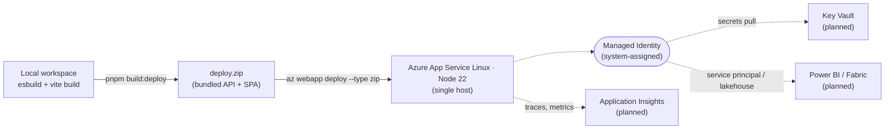

# Architecture

## Context

GTAA Ops Console is a decision-support tool for airport Duty Managers. It
consolidates ML/AI outputs (passenger flow forecasts, gate-allocation
recommendations, CV alerts, sensor anomalies) into a single screen where an
operator can review, decide, and act — with every decision recorded for audit.

The application is deliberately structured so that ML and operational concerns
stay loosely coupled: the UI never embeds model logic, and the API never
exposes raw model internals. Everything flows through stable, versioned
contracts.

## Components

### `apps/web` — React + Vite frontend

- Single SPA, served by Static Web Apps in production.
- TanStack Query owns server state (deduplication, retries, caching).
- React Router for module navigation.
- Auth via MSAL React (Entra ID); a mock provider is used for local dev.
- Imports types and Zod validators from `@gtaa/contracts`, so the API contract
  is checked at compile time.

### `apps/api` — Fastify + TypeScript backend

- REST API, registered via `fastify-type-provider-zod` so route schemas double
  as OpenAPI definitions.
- Plugins:
  - `auth`: validates Entra tokens (or accepts a mock header in dev), exposes
    `requireAuth` / `requireRole` decorators.
  - `audit`: in-memory append-only event store (swap for DB).
  - `error-handler`: maps Zod / Fastify errors to a consistent `ApiError` shape
    with `traceId` for correlation.
- Pino for structured logs with per-request `traceId` (the Fastify request id).
- Swagger UI mounted at `/docs`.

### `packages/contracts` — shared Zod schemas

- Single source of truth for every request/response shape.
- Same schemas drive runtime validation (Fastify), TypeScript types (FE + BE),
  and the OpenAPI spec (`pnpm contracts:openapi`).
- This is the contract boundary referenced when "productionizing prototypes":
  if it isn't in `@gtaa/contracts`, it isn't part of the public surface.

## Data flow

```
ML output (file/queue)
   │
   ▼
apps/api/services/*  ── transforms model output into a stable contract
   │
   ▼
@gtaa/contracts schema validates at the boundary
   │
   ▼
Fastify route returns JSON; OpenAPI spec auto-emitted
   │
   ▼
apps/web TanStack Query consumes the typed contract
   │
   ▼
Operator interacts → POST decision
   │
   ▼
audit plugin writes immutable AuditEvent
```

## Cross-cutting

### Authentication & authorization

- Auth mode is controlled by `AUTH_MODE` env var: `mock` (local) or `entra`
  (Azure AD).
- Roles: `Viewer`, `DutyManager`, `OpsManager`. Encoded as Entra **app roles**
  (not groups) — see [ADR 0004](adr/0004-entra-id-app-roles-not-groups.md).
- Backend enforces with `requireRole`. Frontend mirrors with the same role
  check for UI affordances (disabled buttons, hidden menu items) but trusts
  the server.

### Audit

- Every mutation (recommendation decision, CV-event action, sensor silencing)
  appends to the audit log via the audit plugin — see
  [ADR 0003](adr/0003-audit-log-immutable-pattern.md).
- Every record includes `actorId`, `actorRole`, `before`, `after`, `reason`,
  and `traceId` linking back to the originating request log entry.

### Observability

- Per-request `traceId` (Fastify `request.id`) is:
  - logged on every Pino line for that request,
  - returned in the `x-request-id` response header,
  - returned in every error body,
  - written into the audit record.
- Production wires Pino into Azure App Insights via the OpenTelemetry exporter.

### Error handling

- API errors follow the `ApiError` contract: `{ code, message, traceId, details? }`.
- Validation failures (request schema or response schema) are mapped to a
  `VALIDATION_ERROR` with field-level issues.
- The FE surfaces `traceId` in error toasts to make support tickets actionable.

## Deployment (Azure)



The deployed App Service is a single Linux Node 22 host. Both the Fastify API
and the React SPA bundle ship inside one zip artifact built locally (see
[`apps/api/scripts/build-deploy.mjs`](../apps/api/scripts/build-deploy.mjs))
and pushed with `az webapp deploy`.

Bicep modules and a GitHub Actions OIDC workflow are the planned next steps;
hosting alternatives (Container Apps, Functions) will be compared in a later
ADR. Power BI, Fabric Lakehouse, and Key Vault integrations are documented as
patterns in [ADR 0006](adr/0006-power-bi-embed-via-service-principal.md) and
[ADR 0008](adr/0008-fabric-lakehouse-integration.md); the live demo runs in
**demo mode** with synthetic data.

## Out of scope (for this demo)

- Real ML training pipelines — forecasts are synthesized server-side.
- Multi-tenant isolation — single tenant assumed.
- Long-term audit retention / WORM storage — in-memory store with API ready
  to swap for Azure Table Storage / Cosmos / Postgres.
